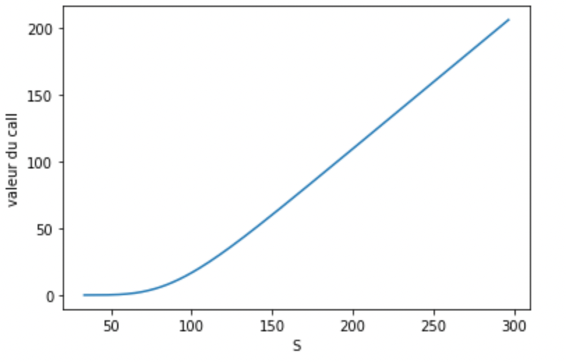
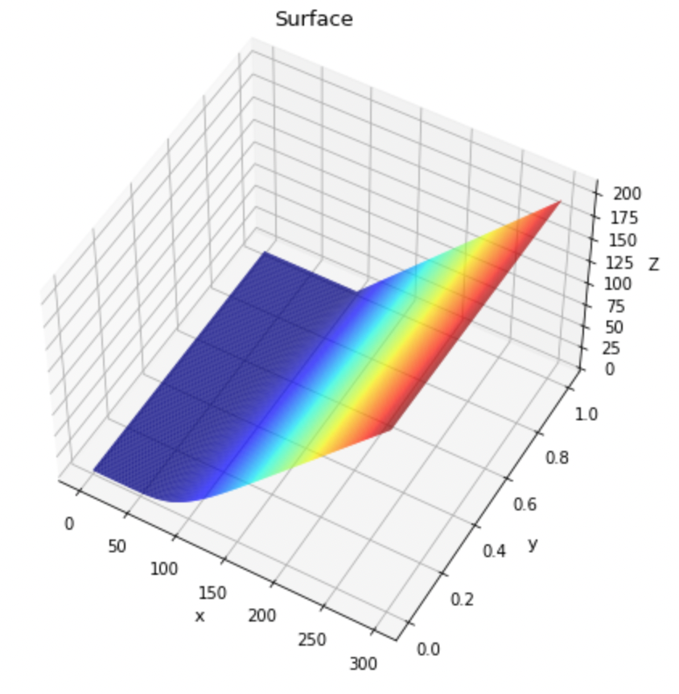

# TP1 : le modèle de Black-Scholes, solutions analytiques

## Code

Le code utilisé pour obtenir les résultats ci-dessous se trouve [ici](./src)

## Résultats obtenus

### Tracé de la solution en t=0 en 2D

### Tracé de la solution en t=0 en 3D

