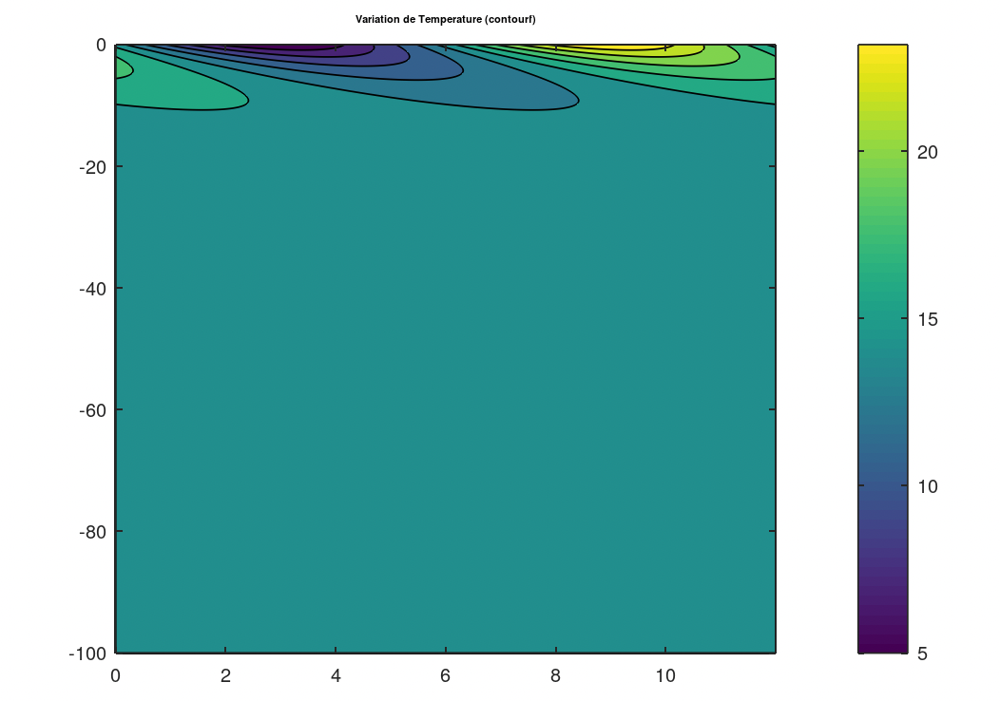
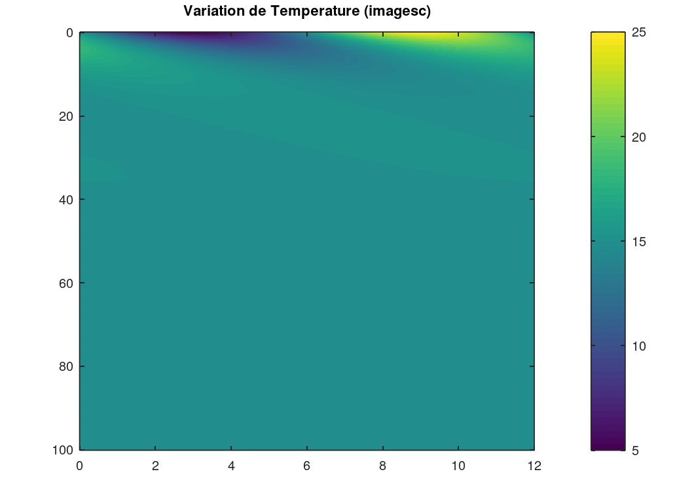
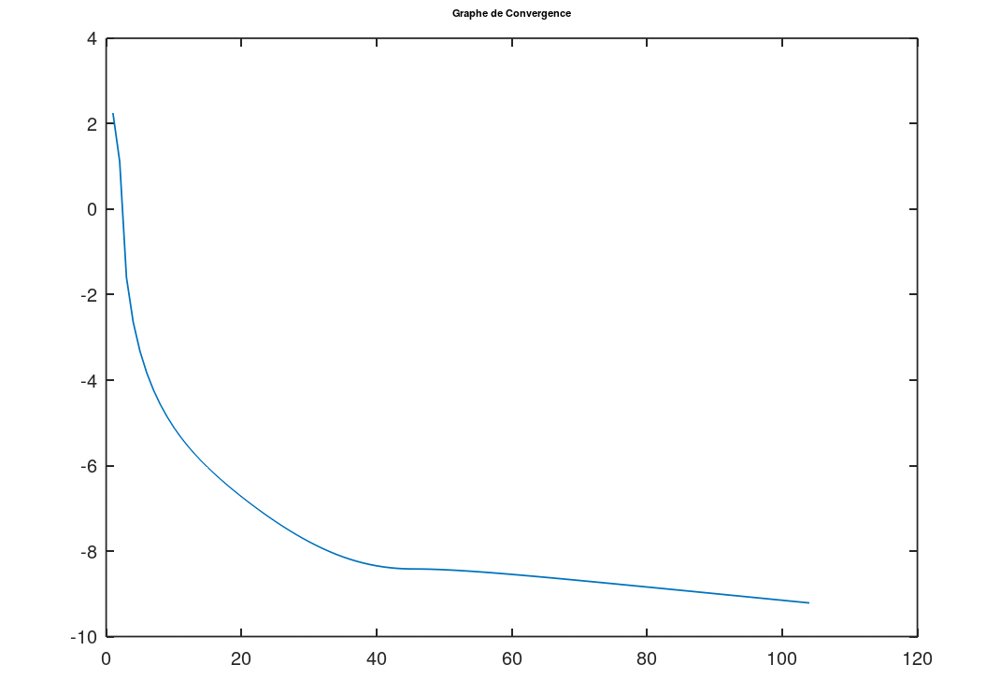
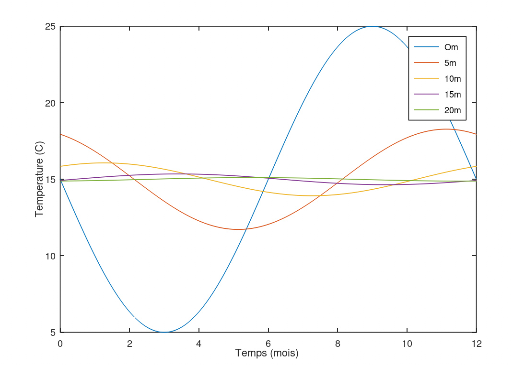
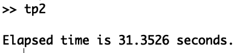

# TP2 : schéma explicite pour l'équation de la chaleur

## Code

Le code utilisé pour obtenir les résultats ci-dessous se trouve [ici](./src)

## Résultats obtenus

Le temps nécessaire aux différents calculs augmente avec R
