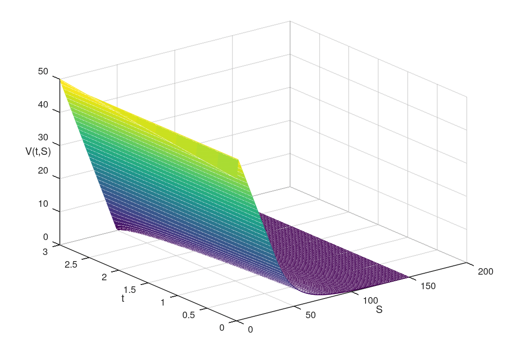
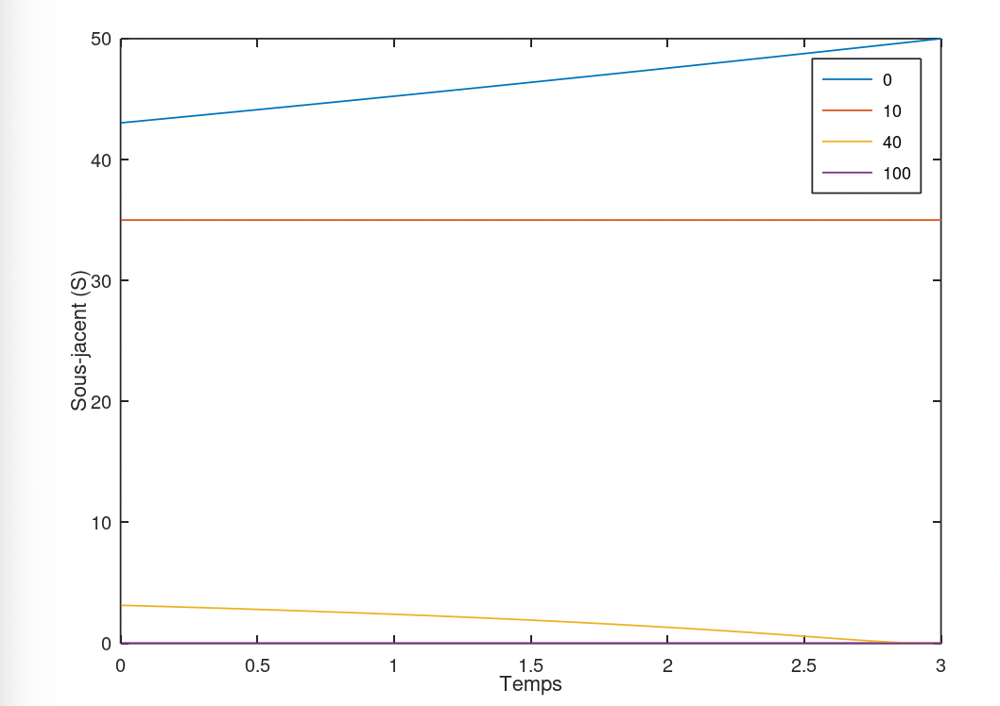

# TP4 : schéma implicite pour l'équation de Black & Scholes

## Exercice : écrire une fonction similaire pour un put européen

### Code

Le code utilisé pour obtenir les résultats ci-dessous se trouve [ici](./src)

### Résultats

#### Iso-valeurs de put

#### Variations 1D

