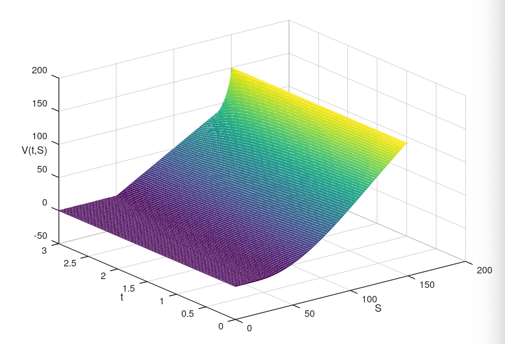
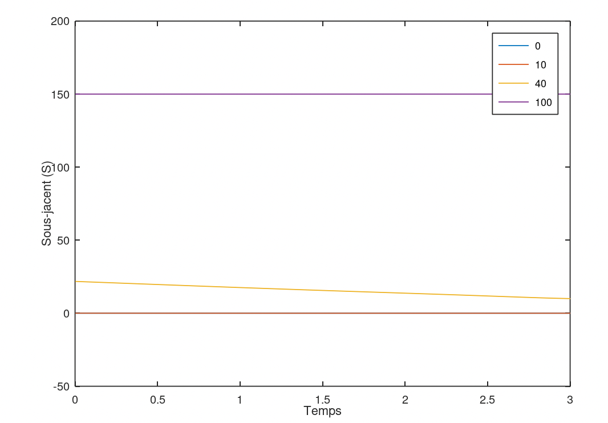

# TP5 : schéma aux différences finies pour les options américaines

## Code

Le code utilisé pour obtenir les résultats ci-dessous se trouve [ici](./src). [put.m](./src/put.m) a été utilisé pour obtenir le [call.m](./src/call.m).

## Résultats

