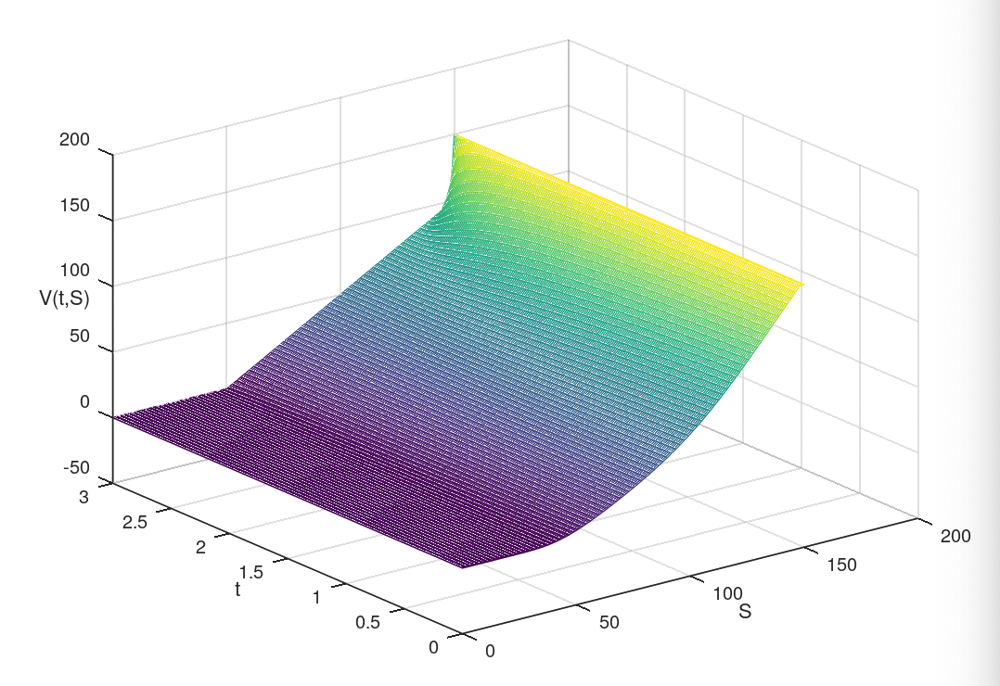
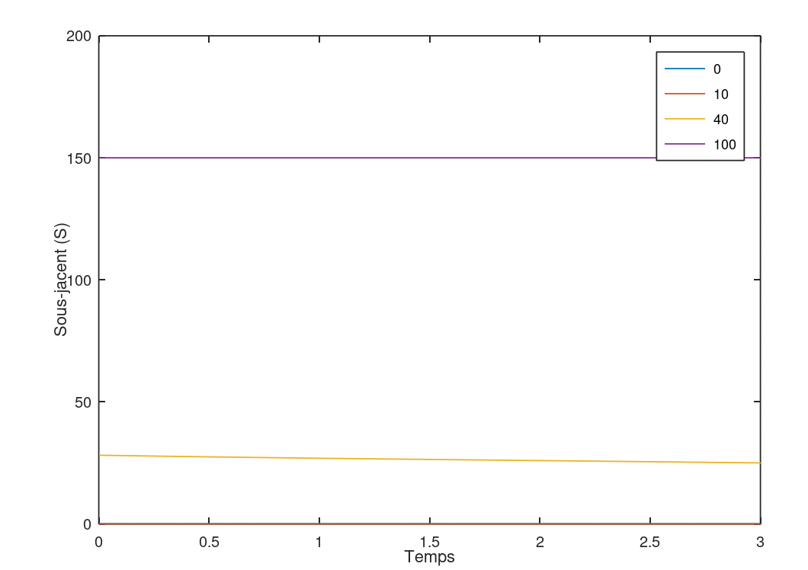

# Projet : schéma de Crank-Nicholson pour les options américaines avec dividende

## Exercice 2 : écrire un programme Matlab-Octave similaire pour un call européen

### Code

Le code utilisé pour obtenir les résultats ci-dessous se trouve [ici](./src)

### Résultats

#### Iso-valeurs de call

#### Variations 1D

